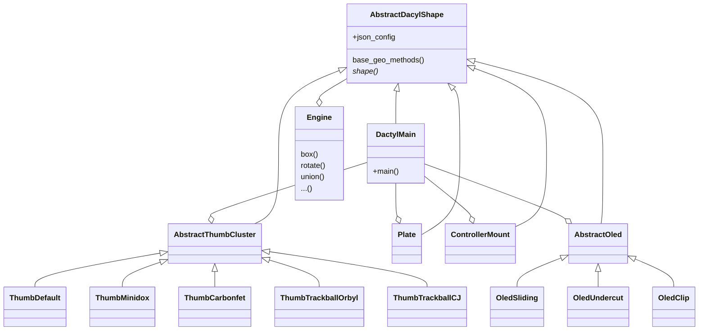

Suggestion Object oriented approach
===================================

When Adding code for the monoblock, I encountered this code as a huge jungle, where I was able to add my code in a dirty way.

Therefore I would like to sugggest an more object orientated approach which could look like the UML diagram. 

The basic idea is to introduce an AbstractDacylShape which handles the basic configuration json aspects adn all objects are inherit and therefore can generating 3D objects will be done in the here defined abstract mehtod.

DactylMain has reference to all components (type AbstractDacylShape). For sure its a risc that this class will explote in future. 

All classes have their default parametrization and therefore the run_config.json only needs values to overwride.

What do you think of this suggestion. I am aware this is a huge rework, but I my impression is that the code already has evolved dramatically, that a disruptive change may help.
